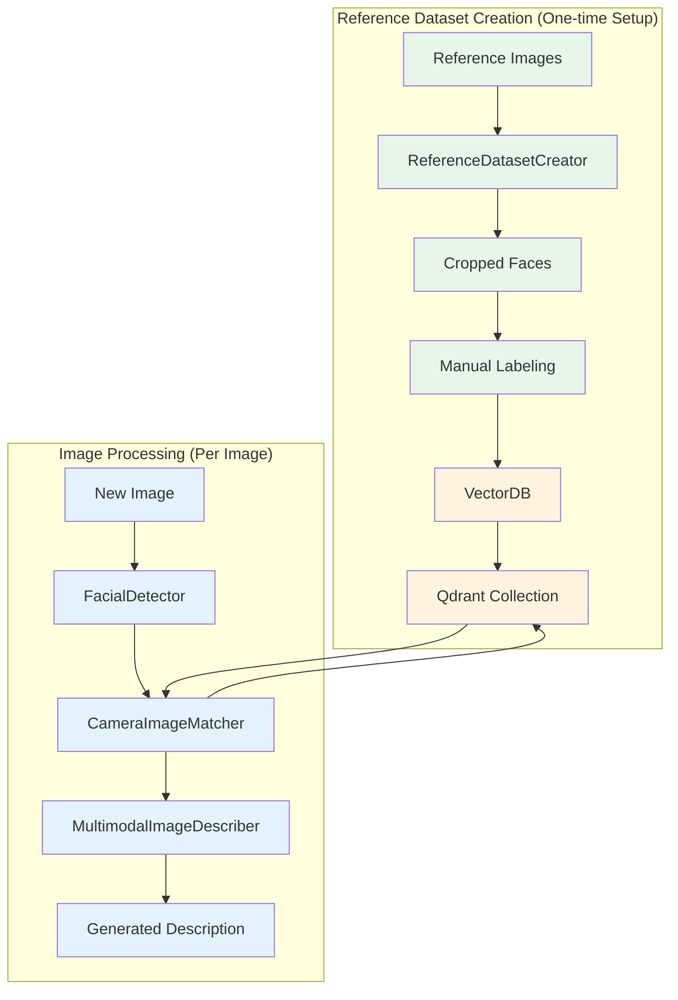

# FaceMatch: AI-Powered Facial Recognition & Multimodal Description System

## Overview

FaceMatch is a modular Python application that demonstrates how to build end-to-end facial recognition workflows using modern deep-learning and vector-database technologies. At its core, the project provides tools to:

- **Detect and embed faces** in images
- **Create a labelled reference dataset** of facial embeddings
- **Store and query these embeddings** in a Qdrant vector database
- **Generate natural language descriptions** of group photos using OpenAI GPT-4o while preserving the privacy of individuals

By following the steps in this repository you can construct a reusable reference dataset, perform face matching, and obtain rich, human-readable captions for your images.

## Core Features

### 🧠 Face Detection & Recognition
- Supports multiple image formats (JPEG, PNG, HEIC, etc.)
- Uses DeepFace for accurate face detection and 512-dimensional embeddings
- Automatic image preprocessing and format conversion

### 📦 Reference Dataset Builder
- Two-step process: extract faces, then label and upload
- Saves cropped faces for manual review and labeling
- Uploads labeled embeddings to Qdrant for matching

### 🗃️ Vector Database
- Qdrant integration for fast similarity search
- Stores face embeddings with metadata (labels, confidence, coordinates)
- Easy collection management and querying

### 🎨 AI-Powered Descriptions
- Privacy-preserving: anonymizes faces before sending to OpenAI
- Multiple modes: humanlike, detailed, or funny descriptions
- Uses GPT-4o for natural language generation

### 🧩 Modular Architecture
- Clean, object-oriented design
- Easy to extend and customize
- Separate components for detection, matching, and generation

## Architecture

The system has two main workflows:

1. **Reference Dataset Creation** (one-time setup)
   - Extract faces from reference images
   - Manual labeling of cropped faces
   - Upload labeled embeddings to Qdrant

2. **Image Processing** (for each new image)
   - Detect faces in new images
   - Match against reference dataset
   - Generate AI descriptions

## System Architecture

The system has two independent workflows: **Reference Dataset Creation** (done once) and **Image Processing** (done for each new image). The only connection is that new images are matched against the reference dataset.



## Quick Start

### Prerequisites
- Python 3.9+
- Docker (for Qdrant)
- OpenAI API key

### 1. Setup Environment

```bash
# Clone and setup
git clone <your-repo-url>
cd multimodal-rag

# Create virtual environment
python -m venv .venv
source .venv/bin/activate  # Windows: .venv\Scripts\activate

# Install dependencies
pip install -e .
```

### 2. Start Qdrant Database

```bash
# Start Qdrant with Docker
docker run -p 6333:6333 -p 6334:6334 -v $(pwd)/qdrant_storage:/qdrant/storage qdrant/qdrant

# Verify it's running
curl http://localhost:6333/collections
```

### 3. Configure API Keys

```bash
# Create environment file
cp .env.example .env

# Edit .env and add your OpenAI API key
# OPENAI_API_KEY=sk-your-actual-api-key-here
```

### 4. Build Reference Dataset (One-time Setup)

```bash
# Add your reference images to data/query_images/
# Then run the dataset creation script
python src/reference_dataset_creation.py
```

This will:
- Extract faces from your images
- Save cropped faces to `data/reference_images_faces/`
- Show you how many faces were detected per image
- Wait for you to add labels, then upload to Qdrant

### 5. Run the Application

**Option A: Command Line**
```bash
python src/main.py
```

**Option B: Web Interface**
```bash
streamlit run app.py
```

The web interface lets you:
- Take photos with your camera
- Choose description style (humanlike/detailed/funny)
- See detected faces and AI-generated descriptions

## Implementation Status

### ✅ Completed Features

- Facial detection, embedding extraction and preprocessing using DeepFace, OpenCV and Pillow
- HEIC/HEIF support via pillow-heif and automatic format conversion
- Two-phase reference dataset creation with face cropping and labelled embedding upload to Qdrant
- Qdrant vector database integration for collection management and upserts
- Privacy-preserving multimodal caption generation using OpenAI GPT-4o with multiple description modes and placeholder replacement
- Complete end-to-end pipeline with main.py
- Interactive Streamlit web interface
- Camera-based face matching and description

### 🚧 Future Work

- Extended support for additional embedding models (e.g. ArcFace vs. Facenet), distance metrics and threshold tuning
- Unit tests and benchmarking of the full pipeline on diverse datasets
- Batch processing capabilities for multiple images
- Real-time video stream processing

## Technical Notes

The code adheres to good Python practices: types are annotated using typing, logs are emitted via Loguru, and environment variables are loaded with python-dotenv. DeepFace is configured to align faces and normalize embeddings (ArcFace normalization) by default. Qdrant collections use a vector size of 512 and cosine distance but these parameters can be changed when calling `create_collection()` in VectorDB. The base64 encoding and prompt templates used by MultimodalImageDescriber follow best practices recommended by OpenAI for vision inputs.

## File Structure

```
multimodal-rag/
├── app.py                          # Streamlit web interface
├── src/
│   ├── main.py                     # Main pipeline orchestrator
│   ├── camera_image_matching.py    # Face detection and matching
│   ├── detect.py                   # Facial detection and embedding
│   ├── vector_db.py                # Qdrant database operations
│   ├── rev_multimodal_generation.py # AI description generation
│   └── reference_dataset_creation.py # Reference dataset builder
├── data/
│   ├── query_images/               # Input images
│   └── reference_images_faces/     # Cropped faces for labeling
├── .env                            # Environment variables (API keys)
└── README.md                       # This file
```

Feel free to explore the source files to understand the internal implementations and adapt them to your own projects.