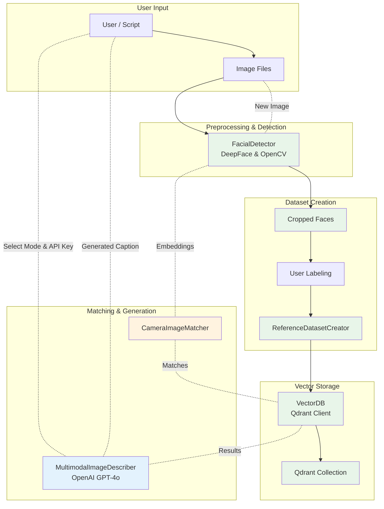

# FaceMatch: AI-Powered Facial Recognition & Multimodal Description System

## Overview

FaceMatch is a modular Python application that demonstrates how to build end-to-end facial recognition workflows using modern deep-learning and vector-database technologies. At its core, the project provides tools to:

- **Detect and embed faces** in images
- **Create a labelled reference dataset** of facial embeddings
- **Store and query these embeddings** in a Qdrant vector database
- **Generate natural language descriptions** of group photos using OpenAI GPT-4o while preserving the privacy of individuals

By following the steps in this repository you can construct a reusable reference dataset, perform face matching, and obtain rich, human-readable captions for your images.

## Core Features

### 🧠 Advanced Face Detection & Embedding

- **Flexible format support**: The FacialDetector class can read JPEG, PNG, BMP, TIFF, WebP, HEIC and HEIF images; it transparently converts high-efficiency formats to RGB/BGR for processing
- **Preprocessing pipeline**: Images are resized and converted on the fly ensuring consistent input to the deep-learning models
- **DeepFace integration**: The DeepFace library is used to detect faces and extract 512-dimensional embeddings

### 📦 Reference Dataset Creation

- **Two-phase workflow**: The ReferenceDatasetCreator guides you through cropping faces from raw images (phase 1) and then uploading the associated embeddings with labels to Qdrant (phase 2)
- **Automatic cropping**: Each detected face is saved as a separate image in `data/reference_images_faces`, allowing you to review and assign real-world names or labels
- **Labelled uploads**: Once labelled, embeddings and metadata are uploaded to a named Qdrant collection so that subsequent queries can return meaningful matches

### 🗃️ Vector Database Integration

- **Qdrant client**: A dedicated VectorDB class manages the connection to your local or remote Qdrant server. It can create and delete collections, upsert embeddings and associated payloads, and validate collection parameters
- **Payload-rich points**: Each stored vector includes the facial bounding box, detection confidence, image path and the user-provided label. This makes it possible to filter and display results in downstream applications

### 🎨 Privacy-Preserving Multimodal Generation

- **Anonymized metadata**: The MultimodalImageDescriber anonymizes each detected face with placeholders (e.g., PersonA, PersonB) before sending the request to OpenAI. A mapping between placeholders and real names is maintained locally so that the final caption can be de-anonymized after the model responds
- **Multiple description modes**: Choose between humanlike, detailed or funny prompts. Humanlike mode yields a natural description of the scene; detailed mode emphasizes clothing and relationships; funny mode produces light-hearted commentary
- **OpenAI GPT-4o integration**: Uses the chat.completions API of GPT-4o to generate coherent paragraphs that reference detected faces without violating privacy

### 🧩 Modular Design

- **Clean separation of concerns**: Each major functionality lives in its own class (FacialDetector, ReferenceDatasetCreator, VectorDB, MultimodalImageDescriber), making the code base easy to test and extend
- **Extensible workflows**: You can plug in your own matching algorithm or user interface on top of these components. For example, a CameraImageMatcher module combines the detector and vector-database layers to match faces in a live feed

## Architecture

FaceMatch implements a layered architecture that divides image processing, data management and generative AI responsibilities. The core layers are:

1. **Preprocessing & Detection Layer** – Handles image loading, conversion and face detection. Built on OpenCV, Pillow and DeepFace
2. **Dataset Creation Layer** – Splits images into cropped faces, associates them with user-provided labels and uploads embeddings to Qdrant. Implemented in `reference_dataset_creation.py` using ReferenceDatasetCreator and VectorDB
3. **Vector Database Layer** – Manages the Qdrant connection and encapsulates collection operations. Implemented in `vector_db.py`
4. **Matching Layer** – Matches new embeddings against the reference collection to find the closest identities. Implemented in `camera_image_matching.py`
5. **Multimodal Generation Layer** – Uses OpenAI GPT-4o to produce textual descriptions given an image and detected face metadata. The MultimodalImageDescriber encapsulates prompt engineering, image encoding and post-processing

## System Architecture

Below is a high-level diagram describing how the components interact. It reflects the two primary workflows: building a reference dataset and generating a description for a new image.



## Getting Started

The following steps will allow you to run FaceMatch end to end. These instructions assume you have Python 3.9 or higher installed and that you are familiar with running commands in a terminal.

### 1. Install Dependencies

Clone the repository (if you haven't already) and create a virtual environment. Then install the required Python packages:

```bash
python -m venv .venv
source .venv/bin/activate  # On Windows use `.venv\Scripts\activate`
pip install --upgrade pip
pip install -r requirements.txt  # Includes deepface, qdrant-client, pillow-heif, loguru, openai
```

### 2. Start a Qdrant Server

Face embeddings are stored in a Qdrant vector database. You can run Qdrant locally using Docker:

```bash
docker run -p 6333:6333 -p 6334:6334 -v $(pwd)/qdrant_storage:/qdrant/storage qdrant/qdrant
```

Once running, the Qdrant dashboard is available at http://localhost:6333/dashboard where you can inspect your collections.

### 3. Configure OpenAI Credentials

The MultimodalImageDescriber uses OpenAI's GPT-4o. Create a `.env` file in the project root and add your API key:

```bash
OPENAI_API_KEY=sk-your-api-key
```

You can also pass the key programmatically when instantiating `MultimodalImageDescriber(api_key="…")`.

### 4. Phase 1 – Extract and Crop Faces

Place the images you want to include in your reference dataset in `data/query_images/`. Then run the reference_dataset_creation.py script:

```bash
python src/reference_dataset_creation.py
```

During phase 1 the script will detect faces in each image, crop them and save them to `data/reference_images_faces/`. It logs how many faces were detected per image so you can prepare labels. Open the cropped images to verify the faces and decide which name corresponds to each crop.

### 5. Phase 2 – Label and Upload

After reviewing the cropped faces, edit the `all_labels` list in `reference_dataset_creation.py` so that each entry corresponds to a detected face. The order of labels must match the order DeepFace returns faces (top-to-bottom, left-to-right). Then re-run the script again; it will embed each face and upload the vectors and labels to the Qdrant collection specified in `collection_name`.

### 6. Run the Complete Pipeline

Use the main pipeline to process images end-to-end:

```bash
python src/main.py
```

This will run the complete face detection, matching, and description generation pipeline.

### 7. Streamlit Web Interface

Launch the interactive web interface:

```bash
streamlit run app.py
```

This provides a user-friendly interface for:
- Taking photos with your camera
- Selecting description modes (humanlike, detailed, funny)
- Viewing face detection results
- Reading AI-generated descriptions

## Implementation Status

### ✅ Completed Features

- Facial detection, embedding extraction and preprocessing using DeepFace, OpenCV and Pillow
- HEIC/HEIF support via pillow-heif and automatic format conversion
- Two-phase reference dataset creation with face cropping and labelled embedding upload to Qdrant
- Qdrant vector database integration for collection management and upserts
- Privacy-preserving multimodal caption generation using OpenAI GPT-4o with multiple description modes and placeholder replacement
- Complete end-to-end pipeline with main.py
- Interactive Streamlit web interface
- Camera-based face matching and description

### 🚧 Future Work

- Extended support for additional embedding models (e.g. ArcFace vs. Facenet), distance metrics and threshold tuning
- Unit tests and benchmarking of the full pipeline on diverse datasets
- Batch processing capabilities for multiple images
- Real-time video stream processing

## Technical Notes

The code adheres to good Python practices: types are annotated using typing, logs are emitted via Loguru, and environment variables are loaded with python-dotenv. DeepFace is configured to align faces and normalize embeddings (ArcFace normalization) by default. Qdrant collections use a vector size of 512 and cosine distance but these parameters can be changed when calling `create_collection()` in VectorDB. The base64 encoding and prompt templates used by MultimodalImageDescriber follow best practices recommended by OpenAI for vision inputs.

## File Structure

```
multimodal-rag/
├── app.py                          # Streamlit web interface
├── src/
│   ├── main.py                     # Main pipeline orchestrator
│   ├── camera_image_matching.py    # Face detection and matching
│   ├── detect.py                   # Facial detection and embedding
│   ├── vector_db.py                # Qdrant database operations
│   ├── rev_multimodal_generation.py # AI description generation
│   └── reference_dataset_creation.py # Reference dataset builder
├── data/
│   ├── query_images/               # Input images
│   └── reference_images_faces/     # Cropped faces for labeling
├── .env                            # Environment variables (API keys)
└── README.md                       # This file
```

Feel free to explore the source files to understand the internal implementations and adapt them to your own projects.