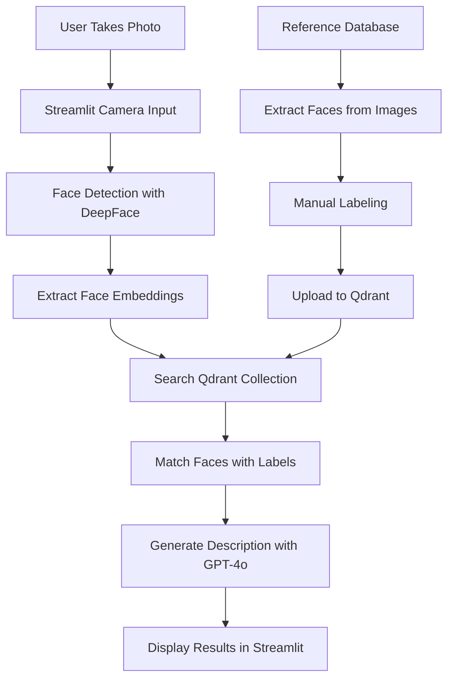

```mermaid
graph TD
    A[User Takes Photo] --> B[Streamlit Camera Input]
    B --> C[Face Detection with DeepFace]
    C --> D[Extract Face Embeddings]
    D --> E[Search Qdrant Collection]
    E --> F[Match Faces with Labels]
    F --> G[Generate Description with GPT-4o]
    G --> H[Display Results in Streamlit]
    
    I[Reference Database] --> J[Extract Faces from Images]
    J --> K[Manual Labeling]
    K --> L[Upload to Qdrant]
    L --> E
```